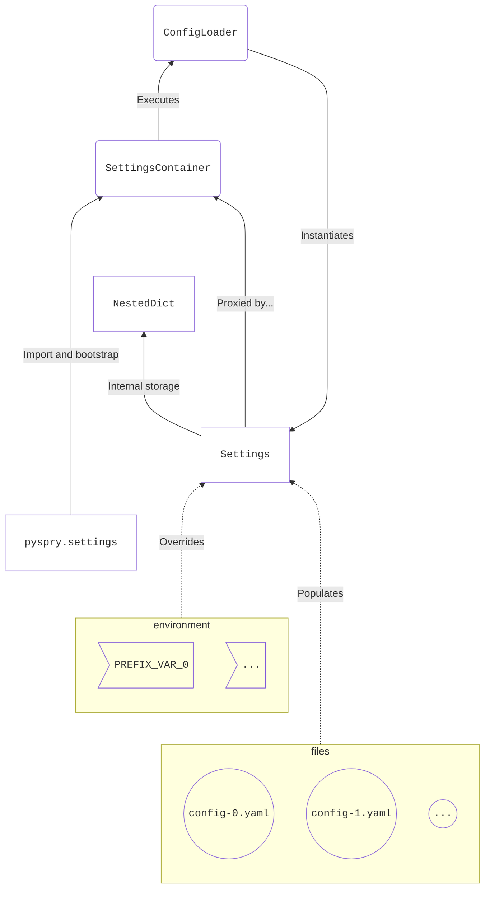

# Architecture

The following diagram shows the dependencies between classes defined in `pyspry.base`. Additionally,
references to external constructs (i.e. files and environment variables) are shown.

